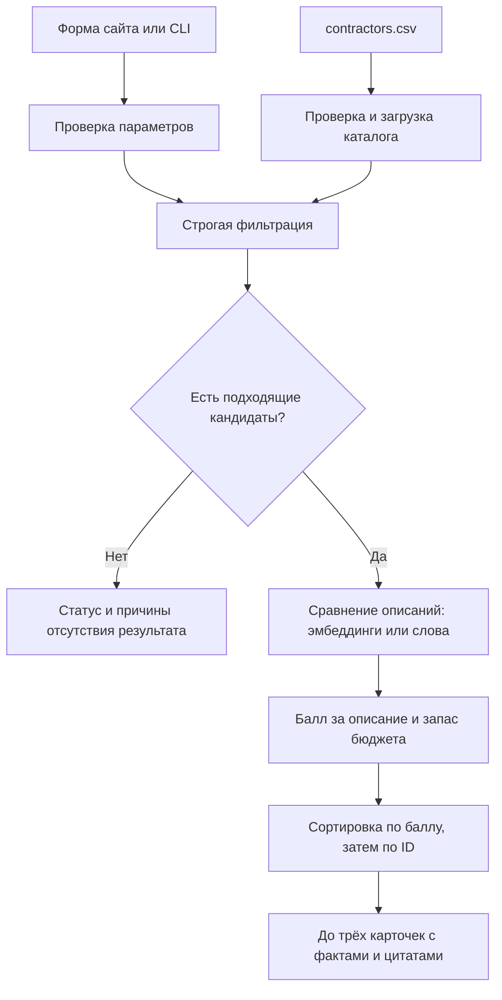

# Умный подбор подрядчиков

Сервис помогает выбрать event-подрядчика из каталога своего города. Пользователь указывает условия мероприятия и получает до трёх карточек с конкретными причинами рекомендации: формат, цена, доступность на дату, язык, длительность и детали из описания.

Проект команды **unsupervised** для HackAlem, задача «Умный подбор подрядчиков (#79-lite)».

В репозитории есть локальный сайт, консольные команды, каталог и автоматические тесты. Приложение работает на **Python 3.10+ без сторонних Python-библиотек**. Подбор можно запустить полностью офлайн. При настроенном ключе доступны эмбеддинги OpenAI для сравнения описаний с запросом.

## Содержание

- [Быстрый запуск](#быстрый-запуск)
- [Подготовка и скачивание](#подготовка-и-скачивание)
- [Как пользоваться сайтом](#как-пользоваться-сайтом)
- [Как устроен подбор](#как-устроен-подбор)
- [Данные и календарь](#данные-и-календарь)
- [Подключение AI](#подключение-ai)
- [Запуск из терминала](#запуск-из-терминала)
- [Сценарии для демонстрации](#сценарии-для-демонстрации)
- [Формат результата](#формат-результата)
- [HTTP API](#http-api)
- [Использование из Python](#использование-из-python)
- [Кэш, повторяемость и время ответа](#кэш-повторяемость-и-время-ответа)
- [Структура проекта](#структура-проекта)
- [Проверки](#проверки)
- [Частые проблемы](#частые-проблемы)
- [Границы решения и развитие](#границы-решения-и-развитие)

## Быстрый запуск

Если проект уже скачан и Python установлен, откройте терминал **в папке проекта**, где лежат `README.md`, `contractors.csv` и `web_preview_server.py`.

```powershell
python --version
python -m unittest discover -v
python web_preview_server.py
```

После сообщения `Open http://127.0.0.1:8765` откройте в браузере:

**[http://127.0.0.1:8765](http://127.0.0.1:8765)**

Сервер сам не открывает браузер. Терминал с сервером должен оставаться открытым; для остановки нажмите `Ctrl+C`. Для других команд используйте второй терминал.

На свежей копии проекта без ключа и кэша сайт использует сравнение по словам. Для гарантированного запуска без внешнего API есть отдельная команда:

```powershell
python demo_ranking.py --offline --city Алматы --date 2026-09-23 --event-type свадьба --category Ведущий --budget 2000000 --preferences "интеллигентный юмор"
```

Она печатает JSON в терминал. Ожидаются `status: matched`, четыре допустимых кандидата и три итоговые карточки. Как включить AI, описано в разделе [Подключение AI](#подключение-ai).

## Подготовка и скачивание

### Что установить

| Что нужно | Для чего |
| --- | --- |
| Python 3.10 или новее | Сервер, загрузка CSV, подбор и тесты |
| Браузер | Работа с сайтом |
| Git | Клонирование и обновление репозитория; при скачивании ZIP не нужен |
| VS Code или другой редактор | Просмотр файлов; для запуска необязателен |

`pip install`, Node.js, npm, Streamlit и отдельный сервер базы данных для запуска приложения не требуются. HTTP-сервер, CSV и SQLite используются из стандартной библиотеки Python. JavaScript выполняется непосредственно в браузере.

Проверьте Python:

```powershell
python --version
```

Если команда не найдена на Windows:

```powershell
py -3 --version
```

Если работает `py -3`, заменяйте им `python` во всех командах. На macOS/Linux обычно используется `python3`. Если Python не установлен или версия ниже 3.10, установите подходящую версию и заново откройте терминал.

### Скачать репозиторий

Через Git:

```powershell
git clone https://github.com/BAITC-Hacks/hack-03a47d56-unsupervised.git
cd hack-03a47d56-unsupervised
```

Если GitHub запрашивает авторизацию, войдите в учётную запись с доступом к репозиторию.

Также можно выбрать **Code → Download ZIP** на странице репозитория, распаковать архив и открыть получившуюся папку. ZIP подходит для запуска, но не содержит историю Git.

В VS Code выберите **File → Open Folder**, откройте папку проекта, затем **Terminal → New Terminal**. Проверьте расположение:

```powershell
Get-Location
Get-ChildItem
```

Все команды ниже рассчитаны на запуск из корня проекта. Виртуальное окружение необязательно: сторонних зависимостей нет.

### Если порт уже занят

Выберите другой порт:

```powershell
python web_preview_server.py --port 8766
```

Откройте `http://127.0.0.1:8766`. Параметры сервера — только `--host` и `--port`; по умолчанию он слушает `127.0.0.1:8765` на этом компьютере.

## Как пользоваться сайтом

1. Выберите город, дату, тип мероприятия и категорию подрядчика.
2. Введите бюджет в тенге за мероприятие.
3. При необходимости укажите язык, длительность и пожелания к стилю работы.
4. Нажмите **«Подобрать подрядчиков»**.
5. Прочитайте объяснения и раскройте **«Проверить балл и факты»** для проверки по данным каталога.

Можно начать с одного из шести готовых сценариев над формой. Нажатие заполняет поля и сразу выполняет поиск; язык и длительность при этом сбрасываются.

В разделе **«Каталог»** можно просмотреть исходные анкеты, загрузить следующие шесть профилей и открыть подробности выбранного подрядчика. Кнопка **«Подобрать в этой категории»** переносит его город и первую категорию в форму и запускает подбор с остальными текущими условиями. Сам просмотр каталога не проверяет доступность на дату; ограничение до трёх относится к результатам подбора.

### Параметры

| Поле | Обязательно | Правило |
| --- | --- | --- |
| Город | Да | В исходном каталоге: Алматы, Астана, Зарубежье |
| Дата | Да | С 23.09.2026 по 31.12.2026 включительно |
| Тип мероприятия | Да | Свадьба, той, корпоратив, конференция, юбилей, день рождения |
| Категория | Да | Например: Ведущий, Фотограф, Флорист, Банкетный зал |
| Бюджет | Да | Неотрицательное число в ₸; сравнивается с ценой «от» |
| Язык | Нет | Русский, казахский или английский; пустое значение означает любой язык |
| Длительность | Нет | Положительное число часов, в том числе `0.5` и `1.25`; пустое поле снимает ограничение |
| Пожелания | Нет | До 2000 символов: например, «спокойная подача и интеллигентный юмор» |

Списки города, категории, формата и языка сайт получает из CSV.

Веб-форма принимает целый бюджет от 0 до 100 млн ₸. CLI и HTTP API допускают также дробный бюджет и используют защитный верхний предел 10¹². Длительность ограничена сверху 10¹² во всех интерфейсах. Нулевая длительность недопустима.

### Что появляется в результате

- До трёх карточек с именем, категорией, городом, ценой «от» и объяснением.
- Количество подходящих кандидатов и причины нехватки карточек.
- Сравнение первого и второго места: баллы за описание и запас бюджета.
- Факты, использованные в объяснении, и цитата из исходного описания.
- Пометки о синтетическом профиле, добавленном городе или цене.
- Причины исключения других подрядчиков из выбранного города и категории.
- Фактический способ сравнения и сообщение о переходе на резервный режим.

Три возможных исхода различаются явно:

| Статус | Значение |
| --- | --- |
| `matched` | Найден хотя бы один подходящий подрядчик |
| `no_category_in_city` | В выбранном городе вообще нет профилей этой категории |
| `no_matches` | Профили такой категории есть, но ни один не прошёл условия |

Пустой результат не является ошибкой. Например, в декабре многие подрядчики заняты; сервис показывает причины и не подменяет запрос другой датой или увеличенным бюджетом.

## Как устроен подбор



### 1. Загрузка каталога

`data_loader.py` читает `contractors.csv`, проверяет обязательные колонки и значения, преобразует списки, числа и флаги. Некорректная строка не пропускается молча: загрузчик выдаёт ошибку с номером строки. Повторяющиеся ID запрещены.

Сервер загружает каталог один раз при старте. CLI загружает его при каждом запуске команды.

### 2. Строгая фильтрация

`filtering.py` сначала выбирает профили по городу и категории, затем проверяет все условия:

| Условие | Когда подрядчик подходит |
| --- | --- |
| Город | Совпадает с городом запроса |
| Категория | Есть отдельным элементом в списке `categories` |
| Дата | Отсутствует в `busy_dates` |
| Бюджет | `price_from_kzt <= budget` |
| Формат | Есть в `event_formats` |
| Язык, если задан | Есть в `languages` |
| Длительность, если задана | `max_hours >= duration_hours` либо `max_hours = null` |

Регистр и лишние пробелы нормализуются. Подстроки, синонимы и опечатки автоматически не сопоставляются: «Ведущий» и «Ведущий церемонии» — разные категории.

`max_hours = null` означает работу без привязки к присутствию на площадке, например флористическое оформление. Такой профиль не исключается из-за длительности. Равенство бюджета цене и длительности лимиту допустимо.

Залы, рестораны и другие площадки проверяются по календарю так же, как ведущие и фотографы. Условия не ослабляются автоматически. Если профиль нарушает несколько условий, сохраняются все причины; сумма счётчиков причин может превышать число исключённых профилей.

Фильтр передаёт ранжированию **всех** допустимых кандидатов. Ограничение до трёх применяется только после расчёта баллов.

### 3. Сравнение описаний

`scorer.py` формирует текст из категории, формата и необязательных пожеланий:

```text
Категория: Ведущий. Формат: свадьба. Пожелания: интеллигентный юмор
```

Если пожеланий нет, сравнение учитывает категорию и формат. Есть два режима:

| Режим | Что происходит |
| --- | --- |
| `auto` | Используются эмбеддинги OpenAI; при их недоступности весь запрос переходит на сравнение слов |
| `offline` | Сразу используется сравнение слов; внешний API не вызывается |

В AI-режиме `embeddings.py` получает числовые векторы текста запроса и описаний. Используется косинусное сходство; отрицательное значение заменяется нулём. По умолчанию выбрана модель `text-embedding-3-small`.

Офлайн-режим выделяет слова, убирает короткие и некоторые служебные слова, оставляет первые пять букв каждого слова и сравнивает частоты полученных фрагментов. Это простая лексическая эвристика; она не понимает синонимы и отрицания надёжным образом.

Пустое описание получает нулевой балл сходства. Если описаний нет у всего допустимого пула, API не нужен и порядок определяется запасом бюджета и ID.

### 4. Итоговый балл

Для прошедших фильтр кандидатов:

```text
запас_бюджета = 1 − цена_от / бюджет
балл = 70 × сходство_описания + 30 × запас_бюджета
```

Например, при сходстве `0.4`, цене 600 000 ₸ и бюджете 1 000 000 ₸:

```text
70 × 0.4 + 30 × (1 − 600000 / 1000000) = 40 баллов
```

Вес 70/30 — выбранная для MVP эвристика. Более низкая начальная цена даёт больший запас бюджета; это не оценка качества подрядчика. Балл не является процентом надёжности или вероятностью успешного мероприятия.

При нулевом бюджете подходят только профили с нулевой ценой; запас бюджета для них принимается равным 1. Язык, дата и длительность уже проверены строго, поэтому одинаковые бонусы за них не начисляются.

Баллы округляются до шести знаков. Сортировка идёт по убыванию балла, при равенстве — по возрастанию `id`. Затем `recommendations.py` оставляет до трёх карточек.

### 5. Объяснения

`explainer.py` составляет объяснение из проверяемых полей и дословной цитаты. Чат-модель для написания объяснений не используется.

Первое предложение перечисляет совпавшие условия. Второе содержит фрагмент описания длиной до 180 символов. При выборе цитаты учитываются слова пожеланий и признаки содержательных деталей: стиль, опыт, оборудование, языки и другие особенности. Самостоятельные приветствия, контакты и представления имени или названия группы отсекаются эвристиками.

Например, вместо «Я Сацуки Кусакабэ — свадебный фотограф» выбирается:

> Люблю живые кадры, настоящие улыбки и моменты, которые невозможно повторить

Если содержательного фрагмента не осталось, сервис сообщает об отсутствии дополнительных деталей. Цитата показывает сведения из анкеты и не превращает их в независимо проверенный факт. Цена остаётся ценой «от», доступность означает отсутствие даты в календаре CSV.

## Данные и календарь

Каталог включён в репозиторий под именем `contractors.csv`. Для первого запуска дополнительный датасет скачивать не нужно.

- 66 профилей; 13 отмечены `synthetic=True`.
- У 9 профилей `max_hours=null`.
- Алматы — 50 профилей, Астана — 15, Зарубежье — 1.
- 17 категорий; профиль может относиться к нескольким категориям.
- Календарь: **2026-09-23 — 2026-12-31**, 100 дней включительно.
- Имена анонимизированы. Добавленные при подготовке данных города и цены отмечены флагами.

| Поле CSV | Содержание |
| --- | --- |
| `id` | Уникальный идентификатор |
| `anon_name` | Анонимизированное имя |
| `categories` | Одна или несколько категорий |
| `city` | Город |
| `price_from_kzt` | Цена «от» в тенге за мероприятие |
| `event_formats` | Поддерживаемые форматы |
| `languages` | Языки работы |
| `max_hours` | Максимум часов; пусто или `null` означает отсутствие привязки к присутствию |
| `busy_dates` | Занятые даты в формате `YYYY-MM-DD` |
| `description` | Свободное описание |
| `synthetic` | Синтетический профиль |
| `city_imputed` | Город добавлен при подготовке данных |
| `price_imputed` | Цена добавлена при подготовке данных |

Файл читается как UTF-8, в том числе с BOM. Колонки разделены запятыми по правилам CSV, элементы списков внутри ячейки — символом `|`. Текст с запятыми или переносами строк заключают в CSV-кавычки. Флаги записываются как `True`/`False`, без учёта регистра. Пустой `busy_dates` допустим.

Дата вне окна календаря вызывает ошибку ввода. Проект не делает выводов о доступности в 2027 году по отсутствию этой даты в CSV. Фиксированные даты демо не отбрасываются из-за текущей системной даты, поэтому примеры воспроизводятся и позднее.

### Использование другого CSV

CLI поддерживает путь к каталогу с той же структурой:

```powershell
python demo_ranking.py --offline --csv "C:\data\my-contractors.csv" --city Алматы --date 2026-09-23 --event-type свадьба --category Ведущий --budget 2000000
```

Путь здесь — пример: замените его на существующий файл. Для сайта используется `contractors.csv` в корне проекта; параметра `--csv` у веб-сервера нет. После изменения файла перезапустите сервер и обновите страницу, чтобы форма получила новые списки из каталога.

Для добавления синтетического профиля заполните все обязательные колонки, задайте уникальный ID и `synthetic=True`. Даты занятости должны оставаться внутри поддерживаемого окна. Новый CSV сам по себе не расширяет окно календаря, заданное в `data_loader.py`.

## Подключение AI

AI используется для сравнения текстов после строгой фильтрации. Дообучения на каталоге, автономного агента, поиска подрядчиков в интернете и генерации анкет в проекте нет.

### Какие данные отправляются

Клиент вызывает `POST https://api.openai.com/v1/embeddings`. В одном пакете отправляются недостающие в кэше тексты: строка запроса и непустые описания допустимых кандидатов. Для одинаковых текстов повторно используются сохранённые векторы.

Отдельные поля календаря и бюджета не добавляются в текст запроса для эмбеддингов. Однако любые сведения, уже написанные в `description` или пожеланиях, входят в отправляемый текст.

### Ключ для локального сайта

Если `.env` ещё нет, создайте его из примера:

```powershell
if (-not (Test-Path -LiteralPath .env)) {
    Copy-Item -LiteralPath .env.example -Destination .env
}
```

Откройте `.env` редактором и заполните строку:

```dotenv
OPENAI_API_KEY=ваш_ключ
```

Сервер читает ключ из `.env` при следующих запросах. Если непустой `OPENAI_API_KEY` был передан через окружение при запуске сервера, именно он имеет приоритет над файлом.

Ключ остаётся на сервере и не передаётся браузеру. `.env` исключён из Git. Не добавляйте настоящий ключ в README, исходники и команды, которые попадут в историю терминала.

Надпись «Ключ OpenAI задан» подтверждает только наличие настройки. После подбора проверяйте фактический режим: **эмбеддинги OpenAI** или **сравнение по словам**, а также сообщение под результатом.

### Ключ для CLI

CLI не загружает `.env` автоматически. В Windows PowerShell задайте ключ в окружении текущего терминала через скрытый ввод:

```powershell
$apiKey = Read-Host "OpenAI API key" -AsSecureString
$env:OPENAI_API_KEY = [System.Net.NetworkCredential]::new("", $apiKey).Password
$apiKey.Dispose()
Remove-Variable apiKey
```

Затем выполните:

```powershell
python demo_ranking.py --require-ai --city Алматы --date 2026-09-23 --event-type свадьба --category Ведущий --budget 2000000 --preferences "спокойный стиль и интеллигентный юмор"
```

Для удаления ключа из окружения этого терминала:

```powershell
Remove-Item Env:OPENAI_API_KEY
```

Уже запущенный сервер имеет собственное окружение. Изменение переменной в другом терминале на него не влияет.

### Выбор модели и подготовка кэша

Модель задаётся **только через окружение процесса**, и для CLI, и для сайта:

```powershell
$env:OPENAI_EMBEDDING_MODEL = "text-embedding-3-small"
```

Строка `OPENAI_EMBEDDING_MODEL` в `.env.example` служит подсказкой: веб-сервер читает из `.env` только ключ, а модель из этого файла не загружает. После изменения модели перезапустите сервер из терминала с новой переменной.

Для предварительной подготовки эмбеддингов всех описаний каталога:

```powershell
python demo_ranking.py --warm-cache --require-ai --city Алматы --date 2026-09-23 --event-type свадьба --category Ведущий --budget 2000000 --preferences "спокойный стиль и интеллигентный юмор"
```

`--warm-cache` обрабатывает все непустые описания, затем выполняет подбор. Подготовка запускается даже при пустом результате фильтрации. Для нового текста запроса всё ещё может понадобиться API. Флаг нельзя совмещать с `--offline`.

`ai.mode=openai` и успешный `--require-ai` при непустой выдаче подтверждают использование эмбеддингов, но не обязательно новый сетевой вызов: результат может быть взят из кэша. При пустой выдаче `--require-ai` также завершается успешно, но режим остаётся `not_used`.

## Запуск из терминала

### Итоговые рекомендации

```powershell
python demo_ranking.py --offline --city Алматы --date 2026-09-23 --event-type свадьба --category Ведущий --budget 2000000 --language казахский --duration-hours 6 --preferences "спокойная подача"
```

### Только фильтрация

```powershell
python demo_filtering.py --city Алматы --date 2026-09-23 --event-type свадьба --category Ведущий --budget 2000000
```

Вторая команда возвращает всех допустимых кандидатов в `candidates`, без ранжирования и итоговых `cards`. Четыре кандидата в этом ответе — правильное поведение: до трёх ограничивает следующий этап.

### Аргументы

| Аргумент | Обязателен | Доступен | Назначение |
| --- | --- | --- | --- |
| `--city` | Да | Обе команды | Город |
| `--date` | Да | Обе команды | Дата `YYYY-MM-DD` |
| `--event-type` | Да | Обе команды | Формат мероприятия |
| `--category` | Да | Обе команды | Категория подрядчика |
| `--budget` | Да | Обе команды | Бюджет в ₸ |
| `--language` | Нет | Обе команды | Требуемый язык |
| `--duration-hours` | Нет | Обе команды | Положительная длительность в часах |
| `--csv` | Нет | Обе команды | Путь к CSV; по умолчанию файл рядом с модулями |
| `--preferences` | Нет | `demo_ranking.py` | Пожелания к стилю и содержанию |
| `--offline` | Нет | `demo_ranking.py` | Полностью исключить вызовы AI API |
| `--require-ai` | Нет | `demo_ranking.py` | Вернуть код 3, если карточки получены без AI |
| `--warm-cache` | Нет | `demo_ranking.py` | Подготовить эмбеддинги каталога перед запросом |

Значения с пробелами заключайте в кавычки: `--category "Банкетный зал"`, `--event-type "день рождения"`. Для дробных чисел в CLI используйте точку: `--duration-hours 1.25`.

`--offline` несовместим с `--require-ai` и `--warm-cache`.

| Код завершения | Значение |
| --- | --- |
| `0` | Валидный результат, включая отсутствие подходящих кандидатов |
| `2` | Ошибка аргументов, входных данных, CSV или принудительной подготовки кэша |
| `3` | При `--require-ai` есть карточки, но использован резервный режим |

При ошибках обработки CLI печатает JSON с `status: error` в stderr. Ошибки самого парсера аргументов, например отсутствие `--city`, выводятся как стандартная справка `argparse`. При пустой выдаче без `--warm-cache` API не нужен, и `--require-ai` не превращает её в ошибку.

## Сценарии для демонстрации

Во всех строках формат — **свадьба**, язык и длительность не заданы. Для плотной категории передано пожелание «интеллигентный юмор»; для остальных пожелания пусты. Количество подходящих кандидатов определяется фильтрами и не зависит от AI.

| Сценарий | Город / категория | Дата | Бюджет, ₸ | Допустимых → карточек | Статус |
| --- | --- | --- | ---: | --- | --- |
| Плотная категория | Алматы / Ведущий | 23.09.2026 | 2 000 000 | 4 → 3 | `matched` |
| Редкая категория | Алматы / Флорист | 04.10.2026 | 1 000 000 | 2 → 2 | `matched` |
| Недостаточный бюджет | Алматы / Ведущий | 01.10.2026 | 1 | 0 → 0 | `no_matches` |
| Нет категории | Зарубежье / Флорист | 04.10.2026 | 1 000 000 | 0 → 0 | `no_category_in_city` |
| Первая дата | Алматы / Ведущий | 01.10.2026 | 1 000 000 | 2 → 2 | `matched` |
| Вторая дата | Алматы / Ведущий | 02.10.2026 | 1 000 000 | 1 → 1 | `matched` |
| Площадка | Алматы / Банкетный зал | 14.11.2026 | 5 000 000 | 2 → 2 | `matched` |

Команды для повторения:

```powershell
python demo_ranking.py --offline --city Алматы --date 2026-09-23 --event-type свадьба --category Ведущий --budget 2000000 --preferences "интеллигентный юмор"
python demo_ranking.py --offline --city Алматы --date 2026-10-04 --event-type свадьба --category Флорист --budget 1000000
python demo_ranking.py --offline --city Алматы --date 2026-10-01 --event-type свадьба --category Ведущий --budget 1
python demo_ranking.py --offline --city Зарубежье --date 2026-10-04 --event-type свадьба --category Флорист --budget 1000000
python demo_ranking.py --offline --city Алматы --date 2026-10-01 --event-type свадьба --category Ведущий --budget 1000000
python demo_ranking.py --offline --city Алматы --date 2026-10-02 --event-type свадьба --category Ведущий --budget 1000000
python demo_ranking.py --offline --city Алматы --date 2026-11-14 --event-type свадьба --category "Банкетный зал" --budget 5000000
```

Для проверки смены даты: 1 октября проходят `HK-42352` и `HK-44923`, 2 октября — другой профиль `HK-35215`. Сообщение результата и причины исключения показывают влияние занятости.

Для проверки повторяемости выполните одну команду дважды и сравните `cards[].id`. При неизменных данных, настройках и кэше порядок должен совпадать. У первого веб-пресета пожелания отличаются от первой CLI-команды, поэтому порядок между этими двумя примерами сравнивать не нужно.

Для живого показа продемонстрируйте плотную категорию, редкую категорию, пустой результат и смену даты. Затем раскройте факты одной карточки и объясните расчёт первого места.

## Формат результата

| Поле | Содержание |
| --- | --- |
| `status` | Один из трёх исходов |
| `message` | Текстовое объяснение результата и количества |
| `request` | Проверенные параметры, включая пожелания |
| `cards` | От нуля до трёх карточек |
| `counts.catalog` | Размер всего каталога |
| `counts.city_category` | Профили в выбранном городе и категории до остальных фильтров |
| `counts.eligible` | Все прошедшие фильтры, до ограничения top-3 |
| `counts.excluded` | Исключённые из выбранного города и категории |
| `reason_counts` | Количество отказов по каждой причине |
| `excluded` | Исключённые профили с причинами |
| `ai.mode` | `openai`, `lexical` или `not_used` |
| `ai.model` | Модель при `openai`, иначе `null` |
| `ai.message` | Объяснение фактически выбранного режима |

Карточка содержит `id`, `name`, `category`, `city`, `price_from_kzt`, `explanation`, `score`, `score_details`, `evidence`, `warnings`, `synthetic`, `city_imputed`, `price_imputed`.

`evidence` связывает утверждения с полями каталога. `warnings` поясняет цену «от» и происхождение данных. В `score_details` видны сходство описания, запас бюджета, их вклады в балл и веса.

Пример первой карточки из плотного CLI-сценария выше. Для краткости показана только часть полей:

```json
{
  "id": "HK-44923",
  "name": "Мицури Канроджи",
  "category": "Ведущий",
  "city": "Алматы",
  "price_from_kzt": 650000,
  "synthetic": false,
  "explanation": "Формат «свадьба» указан в профиле; цена от 650 000 ₸ при бюджете 2 000 000 ₸ (итог уточняется); 2026-09-23 не отмечено занятым в календаре CSV. В описании: «Импровизация, живой интеллигентный юмор…»."
}
```

Полный результат Python/CLI дополнительно сохраняет `candidates`, `calendar_window`, общие словари `evidence` и `warnings`; карточки также содержат `categories`. Веб-ответ короче: он передаёт карточки и диагностику, а не полный пул анкет. У веб-поля `excluded` остаются имя и текстовые причины.

## HTTP API

Сначала запустите `python web_preview_server.py`. API доступен на том же адресе, что и страница.

| Метод и путь | Назначение |
| --- | --- |
| `GET /` | Страница приложения |
| `GET /healthz` | Проверка процесса: `{"status":"ok"}` |
| `GET /api/meta` | Города, категории, форматы, языки, окно календаря, число профилей и наличие ключа |
| `GET /api/catalog` | Исходные профили для просмотра каталога: имена, категории, условия, описания и флаги; без календарей занятости |
| `POST /api/recommend` | Подбор по JSON-параметрам |

`/healthz` не проверяет доступ к OpenAI. Поле `ai_available` в `/api/meta` означает только наличие ключа, а не успешный API-вызов.

Пример для PowerShell, выполняемый во втором терминале:

```powershell
$query = @{
    city = "Алматы"
    date = "2026-09-23"
    event_type = "свадьба"
    category = "Ведущий"
    budget = 2000000
    duration_hours = 1.25
    language = "русский"
    preferences = "интеллигентный юмор"
} | ConvertTo-Json

$response = Invoke-RestMethod -Uri "http://127.0.0.1:8765/api/recommend" -Method Post -ContentType "application/json; charset=utf-8" -Body ([System.Text.Encoding]::UTF8.GetBytes($query))
$response | ConvertTo-Json -Depth 12
```

Тело запроса должно быть JSON-объектом в UTF-8 размером от 1 до 16 384 байт. Поля совпадают с параметрами формы; `duration_hours`, `language` и `preferences` можно не передавать. Отдельного флага `offline` в HTTP API нет: режим выбирает сервер.

Для реализованных маршрутов:

| HTTP-код | Значение |
| --- | --- |
| `200` | Успешный запрос, в том числе `no_matches` и `no_category_in_city` |
| `400` | Некорректный JSON или параметры; ответ содержит `error` |
| `404` | Неизвестный путь |
| `415` | Для подбора передан Content-Type, отличный от `application/json` |
| `500` | Внутренняя ошибка сервера |

Неподдерживаемые HTTP-методы обрабатывает стандартный HTTP-сервер Python; для них не гарантируется такой же JSON-формат ошибки.

## Использование из Python

Функции можно подключить к другому интерфейсу. Пример выполняется из корня проекта и не обращается к внешнему API:

```python
from data_loader import load_contractors
from filtering import filter_contractors
from recommendations import recommend_from_filtered
from scorer import RankingEngine

catalog = load_contractors()
engine = RankingEngine(mode="offline", cache_path=None)

query = {
    "city": "Алматы",
    "date": "2026-09-23",
    "event_type": "свадьба",
    "category": "Ведущий",
    "budget": 2_000_000,
    "preferences": "интеллигентный юмор",
}

filtered = filter_contractors(catalog, query)
result = recommend_from_filtered(
    filtered,
    preferences=query.get("preferences"),
    engine=engine,
)

print(result["status"], result["message"])
for card in result["cards"]:
    print(card["name"], card["price_from_kzt"], card["explanation"])
```

Пожелания передаются адаптеру отдельно: фильтр сохраняет только семь структурированных полей запроса. Иначе текст `preferences` может потеряться между этапами.

В приложении загружайте каталог и создавайте движок один раз, затем переиспользуйте их. `cache_path=None` отключает дисковый кэш ранжирования, но сохраняет кэш объекта в памяти. Для обычного AI-режима создайте `RankingEngine()` с настроенным окружением.

## Кэш, повторяемость и время ответа

### Где хранятся результаты

Каталог `.cache` создаётся автоматически и исключён из Git.

| Файл | Что хранится |
| --- | --- |
| `.cache/embeddings.sqlite3` | Модель, SHA-256 текста и вектор; общий кэш эмбеддингов CLI и сайта |
| `.cache/ranking.sqlite3` | Сохранённый режим и оценки сходства для CLI |
| `.cache/web_preview_rankings.sqlite3` | Сохранённый режим и оценки сходства для сайта |

Векторы кэшируются по точному тексту и модели. В embedding-кэше не сохраняются исходный текст и API-ключ. Ключ кэша ранжирования учитывает проверенный запрос, пожелания, данные подходящих профилей, модель, режим, конфигурацию движка и версию алгоритма.

### Почему порядок не меняется

Алгоритм не использует случайную сортировку. При равном балле порядок определяется ID. Первый результат для конкретного ключа, включая резервный режим, сохраняется и повторно используется.

Поэтому восстановление API само по себе не пересортировывает уже показанный ответ. Одновременные одинаковые запросы внутри одного движка разделяют расчёт; при записи в общий SQLite-кэш используется первый сохранённый результат.

Повторяемость предполагает неизменные данные, настройки и сохранённый кэш. При изменении запроса, подходящих профилей, модели или режима результат может измениться. Если диск недоступен, приложение продолжает работу с памятью процесса, но результат между перезапусками может не сохраниться.

### Если после исправления ключа остаётся сравнение слов

Сохранённый fallback может продолжать использоваться. Замена одного ключа другим не обязана создавать новый ключ кэша.

Для проверки введите новые пожелания. Если нужен пересчёт именно прежних параметров, остановите сервер и CLI, переименуйте соответствующий файл кэша ранжирования из таблицы выше и снова запустите приложение. Кэш эмбеддингов можно оставить. Одного обновления страницы или перезапуска без изменения кэша для пересчёта недостаточно.

Наличие тёплого embedding-кэша позволяет использовать уже полученные векторы даже без API-ключа. Поэтому отсутствие ключа не всегда означает `lexical`; гарантированно исключает AI-режим только `--offline` или `RankingEngine(mode="offline")`.

### Таймаут и одновременные запросы

Сетевой этап по умолчанию имеет общий срок ожидания **6 секунд**, включая соединение, получение заголовков и чтение тела. Автоматических повторов нет. Некорректный ответ, ошибка доступа, недоступная сеть или истечение срока приводят к резервному сравнению слов для всего запроса.

Разные запросы не ждут общей блокировки во время сетевого вызова. Одновременно допускается до четырёх незавершённых сетевых операций; если все слоты заняты, новый запрос сразу использует fallback. Запоздавший ответ не перезаписывает уже выбранный резервный результат.

Шесть секунд — предел ожидания сетевого этапа, а не строгая гарантия времени всего HTTP-ответа: отдельно выполняются фильтрация, операции с кэшем и формирование карточек. Зависший системный DNS нельзя принудительно остановить средствами стандартной библиотеки; до завершения он может занимать один из четырёх слотов, но пользователь уже получает fallback.

При смене пресета браузер прекращает ждать старый ответ. Сервер может закончить начатый расчёт и сохранить его; другой запрос не должен ждать этот расчёт из-за общей блокировки.

### Когда нужен перезапуск

| Что изменилось | Что сделать |
| --- | --- |
| HTML, CSS или JavaScript | Обновить страницу |
| Python-код | Перезапустить сервер |
| `contractors.csv` | Перезапустить сервер и обновить страницу: сервер перечитает каталог, а форма получит новые списки |
| Ключ в `.env` | Выполнить следующий запрос; окружение сервера, если ключ задан там, имеет приоритет |
| Модель или ключ в окружении терминала | Запустить сервер заново из этого терминала |
| Кэш на диске | Перезапустить процесс, чтобы убрать также старый кэш из памяти |

## Структура проекта

```text
.
├── README.md                 Основная инструкция
├── contractors.csv           Каталог из 66 профилей
├── data_loader.py            Чтение и проверка CSV
├── filtering.py              Проверка запроса, строгие условия и причины отказа
├── embeddings.py             Клиент эмбеддингов, дедлайн и кэш векторов
├── scorer.py                 Сходство текстов, баллы, сортировка и кэш ранжирования
├── explainer.py              Проверяемые объяснения и выбор цитат
├── recommendations.py        Сборка до трёх карточек из результата фильтрации
├── demo_filtering.py          CLI для проверки фильтров
├── demo_ranking.py            CLI полного подбора
├── web_preview_server.py     Локальный HTTP-сервер и API
├── web_preview/
│   ├── index.html            Форма и структура страницы
│   ├── app.js                Пресеты, запросы и отображение результатов
│   ├── catalog.js            Просмотр каталога, категорий и подробностей профиля
│   ├── style.css             Оформление
│   ├── hero.png              Иллюстрация интерфейса
│   └── ASSETS.md             Происхождение иллюстрации
├── test_filtering.py          Загрузчик и фильтры
├── test_ranking.py            Ранжирование, интеграция и параллелизм
├── test_embeddings.py         API-контракт, ошибки, кэш и дедлайн
├── test_explainer.py          Факты, цитаты и повторяемость объяснений
├── test_web_preview.py        HTTP-контракт сайта
├── .env.example              Образец настроек
├── .gitignore                Исключение секретов, кэша и служебных файлов
├── FILTERING.md               Подробный контракт фильтрации
├── RANKING.md                 Подробности ранжирования и интеграции
└── LIVE_CHECK.md              Отдельный отчёт команды о живой проверке API
```

`.env`, `.cache` и `__pycache__` — локальные файлы и каталоги; их нет в чистой копии репозитория. Документы участников могут описывать отдельные этапы работы; порядок запуска всего текущего приложения приведён в этом README. Подробные контракты: [FILTERING.md](FILTERING.md) и [RANKING.md](RANKING.md).

## Проверки

Запуск всего набора:

```powershell
python -m unittest discover -v
```

Для версии, описанной в этом README, ожидаются **87 тестов и `OK`**. `Ran 0 tests` не является успешной проверкой проекта: обычно команда выполнена не из той папки.

Отдельные группы:

```powershell
python -m unittest -v test_filtering
python -m unittest -v test_ranking
python -m unittest -v test_embeddings
python -m unittest -v test_explainer
python -m unittest -v test_web_preview
```

| Проверки | Что подтверждают |
| --- | --- |
| Загрузчик и фильтры | 66 профилей, валидацию CSV, все условия, площадки, границы календаря, `null`-часы и три исхода |
| Ранжирование | Полный пул до top-3, формулу, влияние описания, стабильность порядка, кэш и параллельные запросы |
| Клиент эмбеддингов | Формат пакета, порядок векторов, ошибочные ответы, сетевой дедлайн, ограничение фоновых операций и отсутствие поздней записи |
| Объяснения | Дословность цитат, корректность фактов, отсутствие выдуманных ограничений и пропуск пустых представлений |
| HTTP | Дробную длительность, ошибки ввода, три исхода, сообщение о fallback и повторяемость ответа |

Тесты не вызывают настоящий внешний AI API. Для сетевых проверок используются макеты и локальные HTTP-серверы на свободных портах; доступ к loopback должен быть разрешён. Node.js для этих тестов не нужен. Если он установлен, синтаксис браузерного скрипта можно отдельно проверить командой `node --check web_preview/app.js`.

Автотесты не подтверждают работоспособность вашего ключа и текущее качество внешней модели. Для проверки фактического AI-режима используйте команду с `--require-ai`, учитывая возможность попадания в кэш. В [LIVE_CHECK.md](LIVE_CHECK.md) сохранён отдельный отчёт команды о ранее выполненных реальных вызовах.

## Частые проблемы

| Симптом | Причина и действие |
| --- | --- |
| `python` не найден | Попробуйте `py -3`; проверьте установку Python и откройте новый терминал |
| `can't open file ...` | Перейдите в папку с `web_preview_server.py` или нужным CLI-скриптом |
| После запуска ничего не открылось | Вручную откройте адрес, напечатанный сервером |
| Страница открыта как `file:///.../index.html`, подбор не работает | Запустите Python-сервер и используйте `http://127.0.0.1:8765` |
| Порт занят, `WinError 10048` или `Address already in use` | Используйте другой порт, например `--port 8766`, и откройте соответствующий адрес |
| Браузер не соединяется | Проверьте, что сервер работает и адрес/порт совпадают |
| Дата отклонена | Используйте дату внутри 23.09.2026–31.12.2026; другие даты каталог не покрывает |
| Нет результатов или всего одна карточка | Прочитайте причины: занятость, бюджет, формат, язык, часы или малое число профилей |
| Указал длительность `0` | Оставьте поле пустым либо задайте положительное число |
| Создал `.env`, а CLI остаётся без AI | CLI читает окружение; задайте `OPENAI_API_KEY` в том же терминале |
| Изменил модель в `.env`, ничего не изменилось | Модель читается только из окружения; задайте переменную и перезапустите сервер |
| Ключ задан, но результат лексический | Смотрите `ai.message`: возможны ошибка API, таймаут или сохранённый fallback |
| Исправил ключ, а прежний запрос всё ещё лексический | Используется кэш; проверьте новые пожелания или выполните пересчёт по инструкции выше |
| CSV изменён, но сайт показывает старые данные | Перезапустите сервер и обновите страницу |
| Python-код изменён, но поведение старое | Перезапустите сервер; автоматической перезагрузки Python-кода нет |
| Ошибка CSV с номером строки | Исправьте строку, колонки, ID, флаги, числа или даты; повреждённые записи не игнорируются |
| `Ran 0 tests` | Запускайте discovery из корня проекта |

## Границы решения и развитие

Сервис рекомендует подрядчиков по фиксированному каталогу. Бронирование, заявки, уведомления подрядчикам и обновление календарей из внешних систем не реализованы. Свободная дата в CSV не является подтверждённой бронью, а начальная цена не гарантирует итоговую стоимость.

Объяснения ограничены качеством анкет; ранжирование не проверяет правдивость описаний. Веса 70/30 и лексические эвристики не обучены на пользовательской обратной связи. Сервер предназначен для локального демо; публичное развёртывание и эксплуатационная инфраструктура в репозитории не настроены. Отправка кода в GitHub сама по себе не публикует сайт.

Следующие шаги могут включать актуализацию календарей и цен, сбор оценок полезности рекомендаций, проверку весов на размеченных запросах, более точный выбор цитат и расширение каталога. Для публичного сервиса отдельно понадобятся подходящий веб-сервер, управление настройками, ограничение нагрузки и наблюдение за ошибками.
